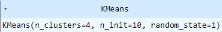
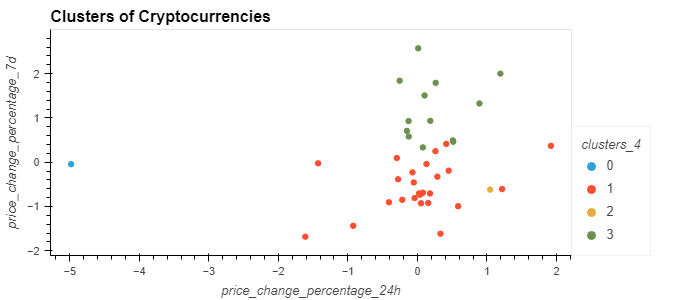
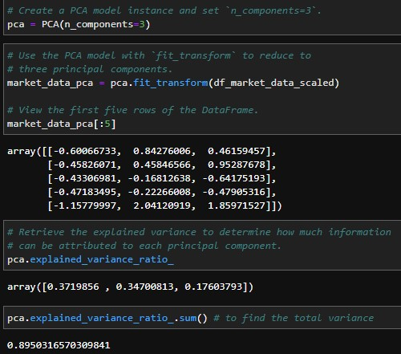
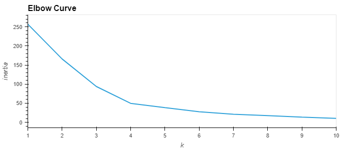
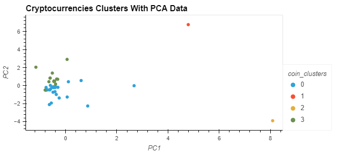

# unsup-homework

# Unsupervised machine learning homework 
## Read the data using read csv function, checked and cleaned the data frame to make sure there were no issues with the data.
### Then ploted the data to show the elbow curve of the clusters in order to find what the correct number of clusters would be.

### Then I created a model using Kmeans to implement the amount of clusters I thought would be correct

### Then I plotted the Kmeans Data 

## Optimize Clusters with Principal Component Analysis is the next step

### With that optimization I found going through the proccess lead to less steps with similar accuracy and results.

# This is the elbow of the PCA data

# This is the cluster of PCA data

## In conclusion after running the Kmeans model with the PCA data and the orginal data the PCA model allows for less time between processing, it achevied the same result in less steps.