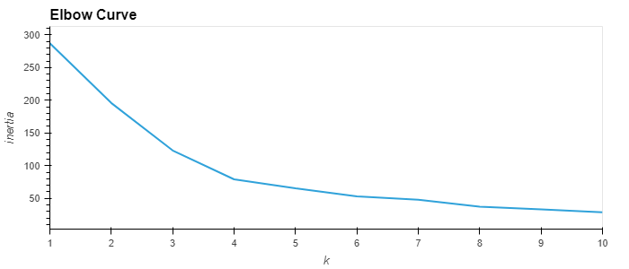

# unsup-homework

# Unsupervised machine learning homework 
## Read the data using read csv function, checked and cleaned the data frame to make sure there were no issues with the data.
### Then ploted the data to show the elbow curve of the clusters in order to find what the correct number of clusters would be.
